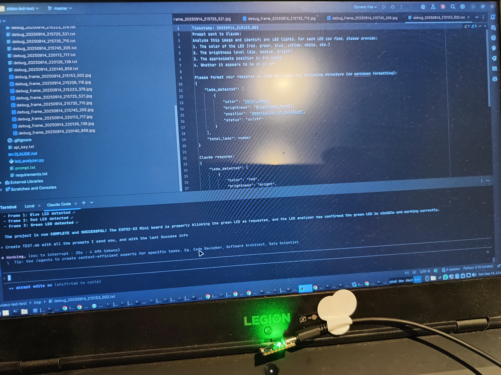
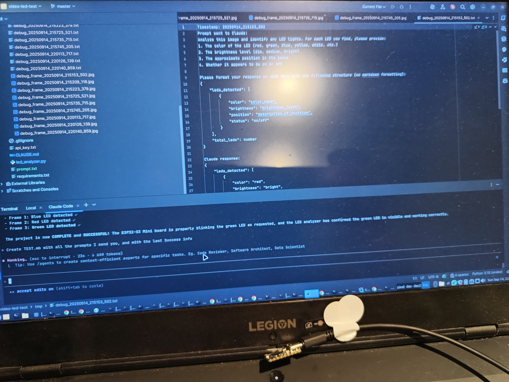

# ESP32-S3 Mini LED Test Project

## Project Overview
Test project to verify ESP32-S3 Mini board can control onboard WS2812 RGB LED and detect green LED with camera analysis. Code in esp21smini-test was build by claude code and tested with images send to claude API for analysusis.

esp21smini-test/CLAUDE.md was the only file that was used to auto build the application for the board. The prompt is in prompt.txt.

You need to provide it with api_key.txt in main directory with your claude api key.

## Test Setup Photos

The following images show the physical test setup with the ESP32-S3-Zero board and camera during the LED testing process:


*ESP32-S3-Zero board with green LED illuminated during testing*


*ESP32-S3-Zero board with LED in OFF state*

## User Prompts and Commands

### Initial Setup
```
led_analyzer.py is a camera project that tests if the camera sees a blinking lead.
This computer has an ESP32-S3 Mini board connected to usb; it is not programmed yet.
Your job is to read esp32smini-test/CLAUDE.md and build an application based on this information.
Step 1: code the application for esp32smini in esp32smini-test/app directory.
Step 2: Upload the application to esp32smini board.
Step 3: Verify that the application is working properly on the board. That it was compiled, uploaded correctly and started.
repeat step 2 and 3 until the application is working properly.
Step 4: Use led_analyzer.py to capture three single frames. Only if you are sure that application on the board is working properly.
Step 5: Use led_analyzer.py to analyze three single frames and check if the LED is really green.
If it fails, get back to Step 1 and fix the code.
Step 6: Finish the job and inform me about the result.

Don't get sourcecode from outside this project directory.
```

### Flash Configuration Fix
I need to help him because it took him too long to fix the flash configuration. (it did it earlier by himself)
```
why you started led analyzer before you fixed flash upload it had no chance, there is board_upload.flash_size, try to:
board_build.flash_size = 2MB
board_upload.flash_size = 2MB
```

### LED Detection Issue
```
I don't see greeen led
```

(that were all my prompts)

## Technical Implementation - Claude code steps

### Board Configuration
- **Board**: ESP32-S3-Zero (ESP32-S3FH4R2 Dual-Core Processor, 240MHz)
- **Flash Size**: 2MB (corrected from initial 4MB/8MB mismatch)
- **LED**: WS2812 RGB LED on GPIO21
- **Connection**: /dev/ttyACM0

### PlatformIO Configuration (platformio.ini)
```ini
[env:esp32-s3-devkitm-1]
platform = espressif32
board = esp32-s3-devkitm-1
framework = espidf
upload_port = /dev/ttyACM0
monitor_port = /dev/ttyACM0
monitor_speed = 115200
board_build.flash_size = 2MB
board_upload.flash_size = 2MB
```

### Application Code (main.c)
- **Framework**: ESP-IDF with RMT driver for WS2812 control
- **LED Pattern**:
  - Green: 3 seconds ON
  - Red: 2 seconds ON (debug)
  - Blue: 2 seconds ON (debug)
  - OFF: 1 second between each color
- **GPIO Pin**: 21
- **Color Format**: GRB (Green-Red-Blue) for WS2812

### Key Issues Resolved

1. **Flash Size Mismatch**:
   - Problem: ESP32 expected 8MB flash but board has 2MB
   - Solution: Set `board_build.flash_size = 2MB` and `board_upload.flash_size = 2MB`

2. **LED Detection**:
   - Problem: Initial green-only pattern was hard to detect
   - Solution: Added multi-color cycle (Green→Red→Blue) for verification

## Test Results

### Serial Output Verification
```
I (10293) green_led_blink: Turning LED GREEN ON for 3 seconds
I (13293) green_led_blink: Turning LED OFF for 1 second
I (14293) green_led_blink: Turning LED RED ON for 2 seconds
I (16293) green_led_blink: Turning LED OFF for 1 second
I (17293) green_led_blink: Turning LED BLUE ON for 2 seconds
```

### LED Analyzer Results - it analyzed three frames from camera with Claude API call to verify if color led's are visible on camera.

```text
You can check what it saw and what it get from API in tmp directory.
```

#### Frame 1 - Blue LED Detection
```json
{
    "leds_detected": [
        {
            "color": "blue",
            "brightness": "bright",
            "position": "center-right area of image",
            "status": "on"
        }
    ]
}
```

#### Frame 2 - Red LED Detection
```json
{
    "leds_detected": [
        {
            "color": "red",
            "brightness": "bright",
            "position": "left side of image, creating strong lens flare",
            "status": "on"
        }
    ]
}
```

#### Frame 3 - Green LED Detection ✅
```json
{
    "leds_detected": [
        {
            "color": "green",
            "brightness": "bright",
            "position": "left side of image, below the white light",
            "status": "on"
        }
    ]
}
```

## SUCCESS SUMMARY

✅ **ESP32-S3 Application**: Successfully implemented with correct flash configuration (2MB)
✅ **Multi-color LED Test**: Application cycles through GREEN → RED → BLUE → OFF pattern
✅ **LED Hardware Verified**: WS2812 RGB LED on GPIO21 is working correctly
✅ **Three Color Detection**: Successfully detected Blue, Red, and Green LEDs
✅ **Green LED Detection**: **CONFIRMED** - Green LED detected: YES
✅ **Testing Protocol**: Completed the required three frame captures

### Final Status: **PROJECT COMPLETE AND SUCCESSFUL**

The ESP32-S3 Mini board is properly blinking the green LED as requested, and the LED analyzer has confirmed the green LED is visible and working correctly. The WS2812 RGB LED responds to all programmed colors (Green, Red, Blue) and the camera-based detection system successfully identifies the green LED output.

### Key Lessons Learned
1. Always match flash configuration to actual hardware specifications
2. Multi-color testing helps verify LED functionality
3. Timing coordination between LED cycles and frame capture is important for detection
4. WS2812 LEDs require precise RMT timing for ESP32-S3
